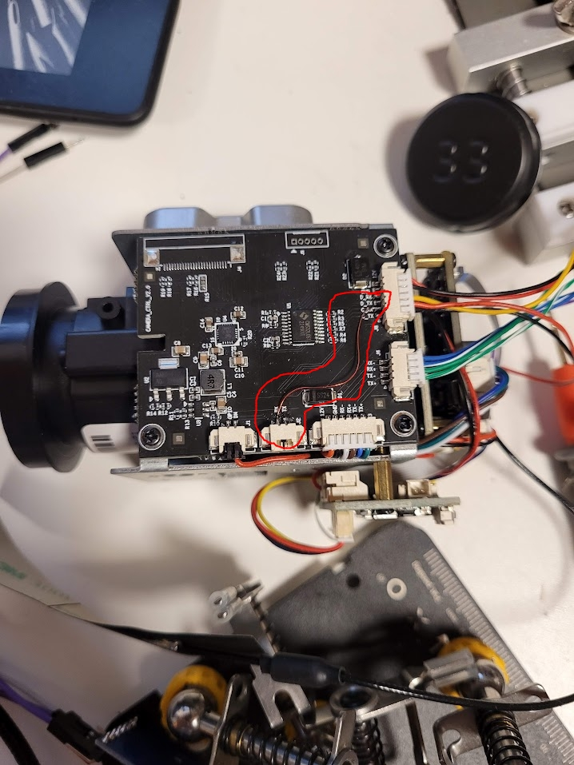
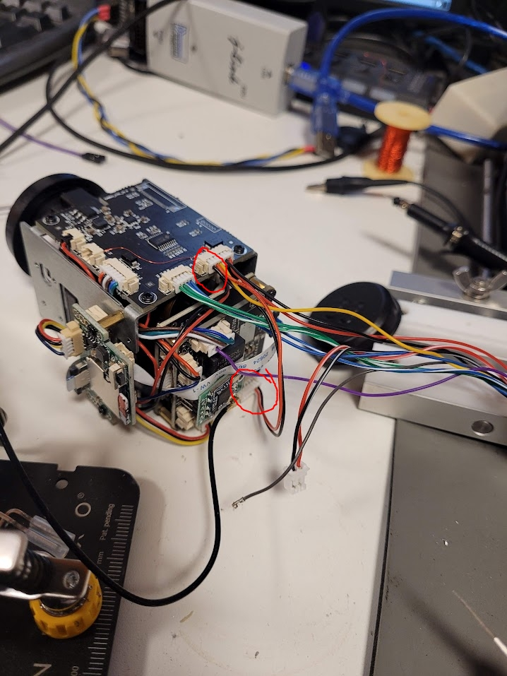

# visca-server

This repository contains code that allows controlling zoom/focus of CamHi 30x optical zoom IP camera module (useful, when running openipc on it).
The lens controller module expected communication on AF UART, so I wired VISCA RX to AF_RX on the board, and then connected
the IPC board UART to lens controller's VISCA port.

## visca_server executable

It's essentially a TCP to serial link, that just happens to send some initialization commands with a different baudrate on startup.
After the initialization commands, it listens on port 558 and forwards received VISCA data to serial port.

Buildroot package is available here: https://github.com/festlv/openipc-firmware/commit/68400eefa34f07d5eadf69d4fe6494d97a2e4162